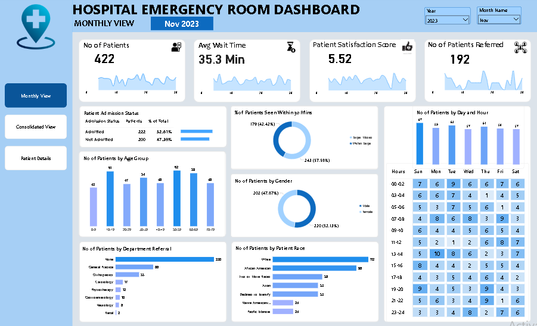
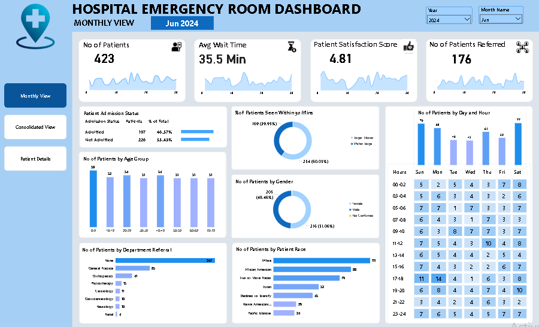
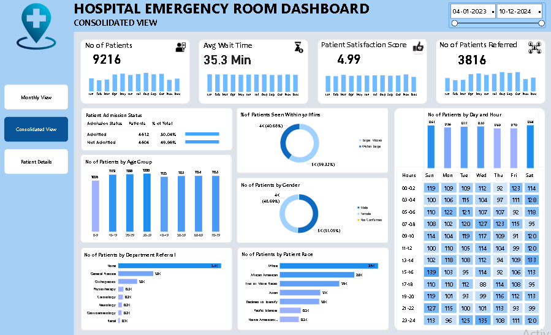
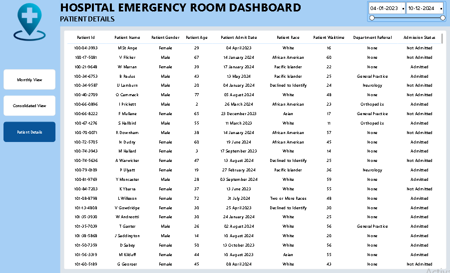

# 🏥 Healthcare Analytics Dashboard

## 📌 Project Overview

This Power BI Healthcare Analytics Dashboard provides comprehensive insights into hospital emergency room operations, patient demographics, admission status, wait times, referrals, and patient satisfaction.

The dashboard helps healthcare administrators monitor performance, improve operational efficiency, and make data-driven decisions to enhance patient care.

---

## 🎯 Business Objectives

- Monitor emergency room patient volume and trends.
- Analyze patient wait times and service efficiency.
- Track patient satisfaction scores.
- Evaluate admission and referral patterns.
- Understand patient demographics and behavior.
- Support hospital management decision-making.

---

## 📊 Dashboard Pages

### 1️⃣ Monthly View
- Total Patients
- Average Wait Time
- Patient Satisfaction Score
- Number of Patients Referred
- Admission Status Analysis
- Age Group Distribution
- Gender Distribution
- Department Referral Analysis
- Patient Race Analysis

### 2️⃣ Consolidated View
- Overall Hospital Performance
- Multi-Month Trend Analysis
- Admission vs Non-Admission Analysis
- Department Referral Trends
- Patient Demographics Overview
- Patient Flow Monitoring

### 3️⃣ Patient Details View
- Detailed Patient Records
- Patient Demographics
- Wait Time Information
- Department Referrals
- Admission Status Tracking

---

## 📈 Key Insights

- Analyzed over 9,000+ patient records.
- Average patient wait time remained around 35 minutes.
- Nearly half of the patients required admission.
- General Practice received the highest number of referrals.
- Patient satisfaction trends revealed opportunities for operational improvements.
- Age and demographic analysis helped identify patient distribution patterns.

---

## 🛠 Tools & Technologies Used

- Power BI
- Power Query
- DAX
- Data Modeling
- Data Cleaning
- Data Visualization

---

## 📷 Dashboard Preview

### Monthly View

### Monthly View (Filtered)

### Consolidated View

### Patient Details

---

## 🎥 Dashboard Walkthrough

Healthcare_Dashboard.mp4

---

## 🚀 Future Enhancements

- Integrate real-time hospital data for live monitoring.
- Add predictive analytics to forecast patient arrivals and emergency room workload.
- Implement patient risk scoring and prioritization models.
- Develop interactive drill-through reports for detailed patient analysis.
- Create department-level performance dashboards.
- Integrate machine learning models for patient wait time prediction.
- Enable automated alerts for critical operational metrics.

---

## ✅ Conclusion

The Healthcare Analytics Dashboard provides a comprehensive view of hospital emergency room operations through interactive visualizations and data-driven insights.

By analyzing patient volume, wait times, admissions, referrals, demographics, and satisfaction scores, the dashboard helps healthcare administrators improve operational efficiency, optimize resource allocation, and enhance patient care.

This project demonstrates the practical application of Power BI, Power Query, DAX, data modeling, and business intelligence techniques in the healthcare domain.

---

## 👨‍💻 Author

**Shaik Irfan**

Aspiring Data Analyst

### Skills Demonstrated

- Data Cleaning
- Data Transformation
- DAX Measures
- KPI Development
- Dashboard Design
- Business Intelligence
- Healthcare Analytics
- Data Visualization

### Connect With Me

- GitHub: https://github.com/Irfan-Shaik-45
- LinkedIn: https://www.linkedin.com/in/shaik-irfan-063b65335

---

⭐ If you found this project interesting, feel free to star the repository. Feedback and suggestions are always welcome.
